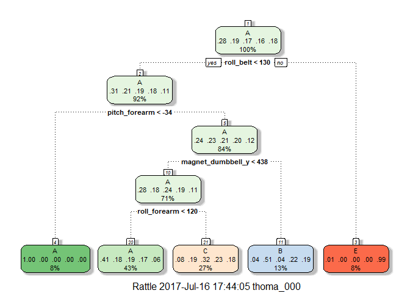
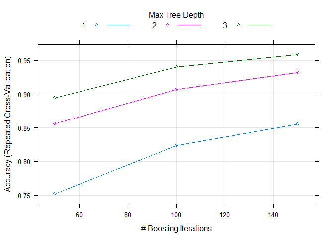
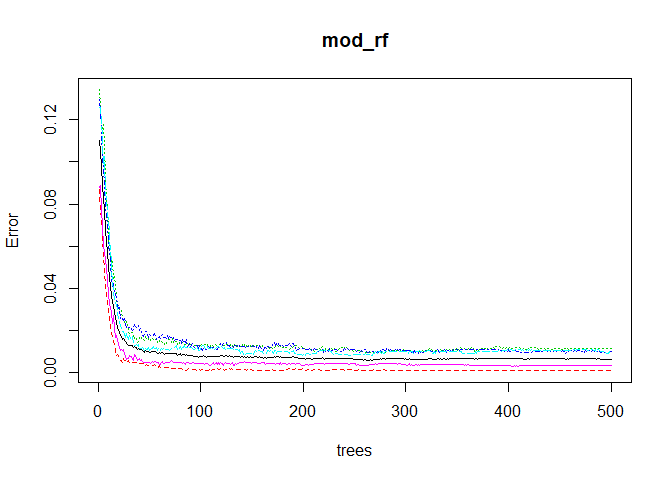

Introduction
------------

Using devices such as Jawbone Up, Nike FuelBand, and Fitbit it is now
possible to collect a large amount of data about personal activity
relatively inexpensively. These type of devices are part of the
quantified self movement - a group of enthusiasts who take measurements
about themselves regularly to improve their health, to find patterns in
their behavior, or because they are tech geeks. One thing that people
regularly do is quantify how much of a particular activity they do, but
they rarely quantify how well they do it. In this project, your goal
will be to use data from accelerometers on the belt, forearm, arm, and
dumbell of 6 participants. They were asked to perform barbell lifts
correctly and incorrectly in 5 different ways. More information is
available from the website here:
<http://groupware.les.inf.puc-rio.br/har> (see the section on the Weight
Lifting Exercise Dataset).

The Data
--------

The training data for this project are available here:

<https://d396qusza40orc.cloudfront.net/predmachlearn/pml-training.csv>

The test data are available here:

<https://d396qusza40orc.cloudfront.net/predmachlearn/pml-testing.csv>

The data for this project come from this source:
<http://groupware.les.inf.puc-rio.br/har>

Goal
----

The purpose of this project is to predict the manner in which the
participants did the exercise, denoted by the "classe" variable in the
training set. To do this we will select the predictors we wish to train
our models on and implement machine learning algorithms that I believe
are the most accurate and best suited for this type of problem.

Reproducibility
---------------

For this project I will use the following R libraries and seed for
reproducible results.

    library(caret)
    library(rpart)
    library(RColorBrewer)
    library(rpart.plot)
    library(rattle)
    library(randomForest)
    library(knitr)

    set.seed(6969)

Data Processing
---------------

First we need to load and clean our training and test data. Any
processing we do to training we will do the same on the test set. Then
we will partition our training set further into training and validation
sets.

    train_url <- "https://d396qusza40orc.cloudfront.net/predmachlearn/pml-training.csv"
    test_url <- "https://d396qusza40orc.cloudfront.net/predmachlearn/pml-testing.csv"

    training_raw <- read.csv(url(train_url))
    testing_raw <- read.csv(url(test_url))

The first few columns of the data do not provide any relevant
information on the exercises performed, so let's remove those first.

    training_wip <- training_raw[,-(1:7)]
    testing_wip <- testing_raw[,-(1:7)]

It also appears that a lot of columns have a high percentage of missing
values, so let's remove those as well.

    # set the threshold so we will remove any observation with more than 2/3rds of its data missing
    threshold = 0.66

    missing_freqs_training <- lapply(training_wip, function(x) sum(is.na(x))/length(x))
    missing_freqs_testing <- lapply(testing_wip, function(x) sum(is.na(x))/length(x))

    training_wip <- training_wip[, missing_freqs_training < threshold]
    testing_wip <- testing_wip[, missing_freqs_testing < threshold]

Lastly I will remove columns with Near-Zero variance, as they will not
be useful as predictors to train on. Also we will coerce all data into
the same class for consistency.

    nzv_train <- nearZeroVar(training_wip, saveMetrics = T)
    training_wip <- training_wip[,nzv_train$nzv == F]

    nzv_test <- nearZeroVar(testing_wip, saveMetrics = T)
    testing_wip <- testing_wip[,nzv_test$nzv == F]

    # coerce all data to numeric, except for outcome (factor)
    training_clean <- data.frame(lapply(training_wip[,-ncol(training_wip)], as.numeric), classe = training_wip$classe)
    testing_clean <- data.frame(lapply(testing_wip, as.numeric))

    ncol(training_raw) - ncol(training_clean)

    ## [1] 107

    ncol(training_clean)

    ## [1] 53

We ended up removing 107 columns from the original dataset, leaving us
with a total of 52 predictors, for a total of 53 columns counting the
outcomes.

Cross Validation
----------------

We will split our processed training set into a smaller training set,
and a validation set as a means for validating each model before moving
on to the test set. Later on, I will employ repeated cross validation on
the smaller training set for algorithms that may be more computationally
intensive, since this dataset is still fairly large.

    inTrain <- createDataPartition(training_clean$classe, p = 0.6, list = F)
    myTrain <- training_clean[inTrain,]
    validation <- training_clean[-inTrain,]

Prediction Model 1: Classification Tree
---------------------------------------

Since our outcomes are categorical, it is reasonable to first try out a
decision tree.

    mod_rpart <- train(classe ~ ., data = myTrain, method = 'rpart')
    fancyRpartPlot(mod_rpart$finalModel)

    pred_rpart <- predict(mod_rpart, validation)
    result <- confusionMatrix(validation$classe, pred_rpart)
    result

    ## Confusion Matrix and Statistics
    ## 
    ##           Reference
    ## Prediction    A    B    C    D    E
    ##          A 2038   28  160    0    6
    ##          B  615  528  375    0    0
    ##          C  631   42  695    0    0
    ##          D  559  238  489    0    0
    ##          E  208  210  379    0  645
    ## 
    ## Overall Statistics
    ##                                          
    ##                Accuracy : 0.4978         
    ##                  95% CI : (0.4867, 0.509)
    ##     No Information Rate : 0.5163         
    ##     P-Value [Acc > NIR] : 0.9995         
    ##                                          
    ##                   Kappa : 0.344          
    ##  Mcnemar's Test P-Value : NA             
    ## 
    ## Statistics by Class:
    ## 
    ##                      Class: A Class: B Class: C Class: D Class: E
    ## Sensitivity            0.5031   0.5048  0.33127       NA  0.99078
    ## Specificity            0.9489   0.8544  0.88292   0.8361  0.88923
    ## Pos Pred Value         0.9131   0.3478  0.50804       NA  0.44730
    ## Neg Pred Value         0.6414   0.9181  0.78342       NA  0.99906
    ## Prevalence             0.5163   0.1333  0.26740   0.0000  0.08297
    ## Detection Rate         0.2598   0.0673  0.08858   0.0000  0.08221
    ## Detection Prevalence   0.2845   0.1935  0.17436   0.1639  0.18379
    ## Balanced Accuracy      0.7260   0.6796  0.60709       NA  0.94001

With an overall accuracy of <code>0.4915</code>, this clearly is not the
best model fit. Looking at the confusion matrix we can see that our
model completely fails to predict outcome D, and is widely inaccurate
for A, B, and C, so we need to try something else.

Model 2: Boosting
-----------------

Since boosting is an iterative process and our dataset is fairly large,
I will set a <code>trainControl</code> object in the <code>train</code>
function to perform repeated cross validation and break the training set
into 5 folds.

    fitControl <- trainControl(method = "repeatedcv", number = 5, repeats = 1)

    mod_gbm <- train(classe ~ ., data = myTrain, method = 'gbm', trControl = fitControl, verbose = F)

    ## Warning: package 'gbm' was built under R version 3.4.1

    pred_gbm <- predict(mod_gbm, validation)
    result <- confusionMatrix(validation$classe, pred_gbm)
    result; plot(mod_gbm)

    ## Confusion Matrix and Statistics
    ## 
    ##           Reference
    ## Prediction    A    B    C    D    E
    ##          A 2194   24   10    3    1
    ##          B   47 1432   36    2    1
    ##          C    0   44 1306   15    3
    ##          D    1    6   57 1212   10
    ##          E    2   18   13   27 1382
    ## 
    ## Overall Statistics
    ##                                           
    ##                Accuracy : 0.9592          
    ##                  95% CI : (0.9546, 0.9635)
    ##     No Information Rate : 0.286           
    ##     P-Value [Acc > NIR] : < 2.2e-16       
    ##                                           
    ##                   Kappa : 0.9484          
    ##  Mcnemar's Test P-Value : 4.057e-12       
    ## 
    ## Statistics by Class:
    ## 
    ##                      Class: A Class: B Class: C Class: D Class: E
    ## Sensitivity            0.9777   0.9396   0.9184   0.9627   0.9893
    ## Specificity            0.9932   0.9864   0.9903   0.9888   0.9907
    ## Pos Pred Value         0.9830   0.9433   0.9547   0.9425   0.9584
    ## Neg Pred Value         0.9911   0.9855   0.9821   0.9928   0.9977
    ## Prevalence             0.2860   0.1942   0.1812   0.1605   0.1781
    ## Detection Rate         0.2796   0.1825   0.1665   0.1545   0.1761
    ## Detection Prevalence   0.2845   0.1935   0.1744   0.1639   0.1838
    ## Balanced Accuracy      0.9855   0.9630   0.9544   0.9757   0.9900

With an overall accuracy of <code>0.9592</code>, this is a significant
improvement on the classification method.

Method 3: Random Forest
-----------------------

    mod_rf <- randomForest(classe ~ ., data = myTrain)
    pred_rf <- predict(mod_rf, validation)
    result <- confusionMatrix(validation$classe, pred_rf)
    result; plot(mod_rf)

    ## Confusion Matrix and Statistics
    ## 
    ##           Reference
    ## Prediction    A    B    C    D    E
    ##          A 2231    1    0    0    0
    ##          B    5 1512    1    0    0
    ##          C    0   11 1357    0    0
    ##          D    0    0   18 1266    2
    ##          E    0    0    0    5 1437
    ## 
    ## Overall Statistics
    ##                                          
    ##                Accuracy : 0.9945         
    ##                  95% CI : (0.9926, 0.996)
    ##     No Information Rate : 0.285          
    ##     P-Value [Acc > NIR] : < 2.2e-16      
    ##                                          
    ##                   Kappa : 0.9931         
    ##  Mcnemar's Test P-Value : NA             
    ## 
    ## Statistics by Class:
    ## 
    ##                      Class: A Class: B Class: C Class: D Class: E
    ## Sensitivity            0.9978   0.9921   0.9862   0.9961   0.9986
    ## Specificity            0.9998   0.9991   0.9983   0.9970   0.9992
    ## Pos Pred Value         0.9996   0.9960   0.9920   0.9844   0.9965
    ## Neg Pred Value         0.9991   0.9981   0.9971   0.9992   0.9997
    ## Prevalence             0.2850   0.1942   0.1754   0.1620   0.1834
    ## Detection Rate         0.2843   0.1927   0.1730   0.1614   0.1832
    ## Detection Prevalence   0.2845   0.1935   0.1744   0.1639   0.1838
    ## Balanced Accuracy      0.9988   0.9956   0.9922   0.9965   0.9989

Here we achieve an overall accuracy of <code>0.9931</code>, which is
better than both methods we tried previously.

Combining predictors
--------------------

Although we already have an exceptionally high accuracy using Random
Forest, it would be interesting if we can acheive an even higher
accuracy by combining our predictors.

    predDF <- data.frame(pred_rpart, pred_gbm, pred_rf, classe = validation$classe)
    mod_comb <- randomForest(classe ~ ., data = predDF)
    pred_comb <- predict(mod_comb, validation)
    result <- confusionMatrix(validation$classe, pred_comb)
    result

    ## Confusion Matrix and Statistics
    ## 
    ##           Reference
    ## Prediction    A    B    C    D    E
    ##          A 2231    1    0    0    0
    ##          B    5 1512    1    0    0
    ##          C    0   11 1357    0    0
    ##          D    0    0   18 1266    2
    ##          E    0    0    0    5 1437
    ## 
    ## Overall Statistics
    ##                                          
    ##                Accuracy : 0.9945         
    ##                  95% CI : (0.9926, 0.996)
    ##     No Information Rate : 0.285          
    ##     P-Value [Acc > NIR] : < 2.2e-16      
    ##                                          
    ##                   Kappa : 0.9931         
    ##  Mcnemar's Test P-Value : NA             
    ## 
    ## Statistics by Class:
    ## 
    ##                      Class: A Class: B Class: C Class: D Class: E
    ## Sensitivity            0.9978   0.9921   0.9862   0.9961   0.9986
    ## Specificity            0.9998   0.9991   0.9983   0.9970   0.9992
    ## Pos Pred Value         0.9996   0.9960   0.9920   0.9844   0.9965
    ## Neg Pred Value         0.9991   0.9981   0.9971   0.9992   0.9997
    ## Prevalence             0.2850   0.1942   0.1754   0.1620   0.1834
    ## Detection Rate         0.2843   0.1927   0.1730   0.1614   0.1832
    ## Detection Prevalence   0.2845   0.1935   0.1744   0.1639   0.1838
    ## Balanced Accuracy      0.9988   0.9956   0.9922   0.9965   0.9989

Our accuracy is almost the same as before, so combining all of our
previous predictors does not seem to have an effect. Thus, it is safe to
say that Random Forest performed the best out of the three.

Predicting on Test Data
-----------------------

We will use the best performing model, Random Forest, to predict on the
test cases. Since our overall accuracy was <code>.9941</code>, we should
expect the out of sample error to be <code>0.59%</code>.

    pred_test <- predict(mod_rf, testing_clean)
    print(pred_test)

    ##  1  2  3  4  5  6  7  8  9 10 11 12 13 14 15 16 17 18 19 20 
    ##  B  A  B  A  A  E  D  B  A  A  B  C  B  A  E  E  A  B  B  B 
    ## Levels: A B C D E
